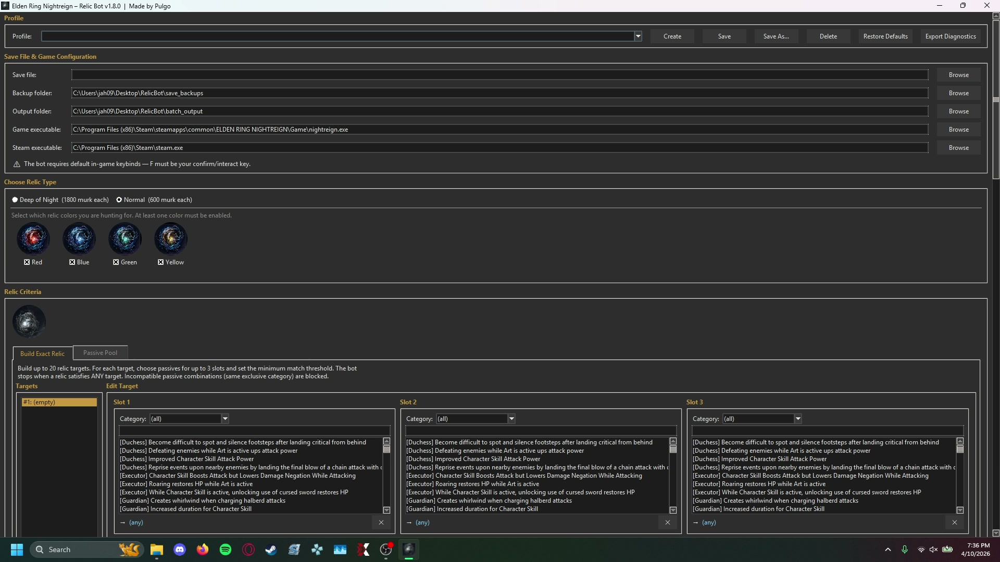
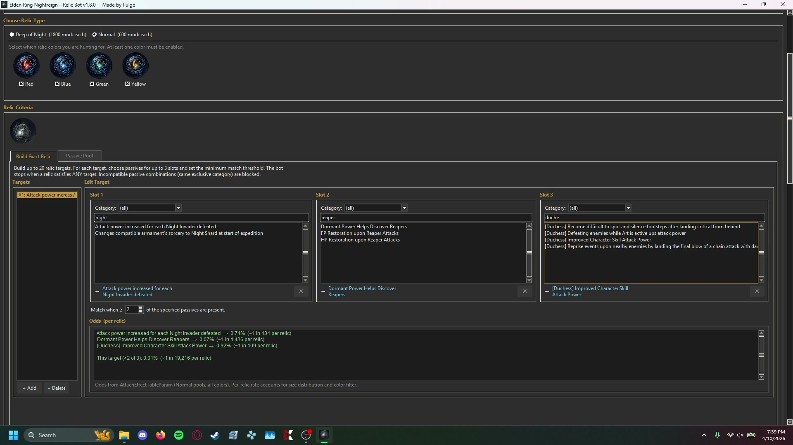
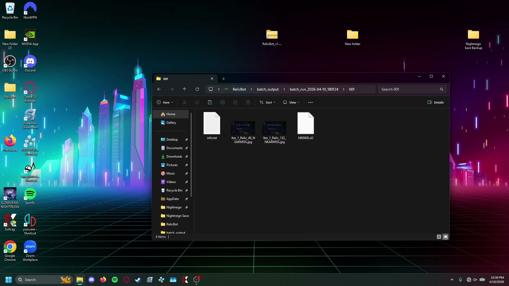
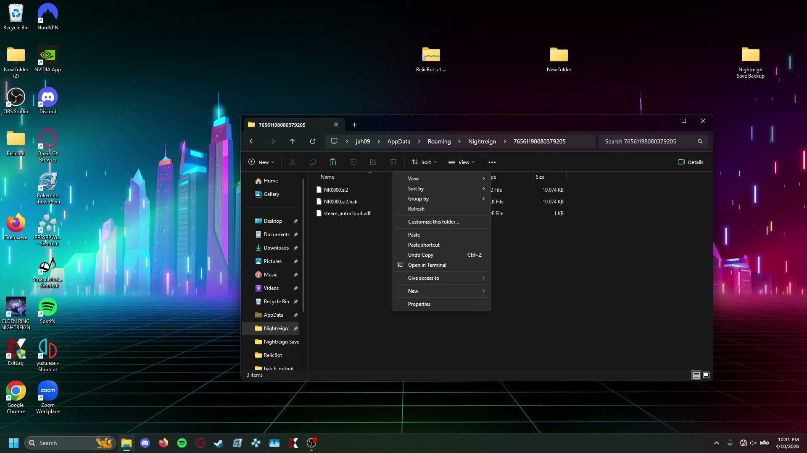

# Installation & First-Time Setup

This page walks you through everything you need to do before running the bot for the first time.

---

## Step 1 — Download & Extract

1. Go to the [Releases](https://github.com/PulgoMaster/Pulgo-Elden-Ring-Nightreign-Relic-Farming-Bot/releases) page
2. Download the latest `RelicBot_vX.Y.Z.zip`
3. Extract the ZIP to a local folder — for example `C:\RelicBot\`

**Important:** Do NOT extract to a cloud-synced folder (OneDrive, Dropbox, Google Drive). Cloud sync services lock files and prevent the GPU upgrade from completing.

---

## Step 2 — Back Up Your Save

Before touching anything else, make a personal backup of your save file.

Your save is located at:
```
C:\Users\<YourName>\AppData\Roaming\Nightreign\<SteamID>\NR0000.sl2
```

**To find it:**
1. Press **Windows + R** to open the Run dialog
2. Type `%AppData%` and press Enter
3. Navigate to `Roaming\Nightreign\<YourSteamID>\`
4. Copy `NR0000.sl2` to a safe location (Desktop, USB drive, etc.)

**Do this every time before running the bot.** The bot manages its own backup, but a personal copy is your safety net.

---

## Step 3 — Launch RelicBot

Run `RelicBot.exe` from the extracted folder. No Python or other software is needed — everything is bundled.

On first launch, the bot downloads its OCR model (~100 MB). This is a one-time download — after that the bot works fully offline.

---

## Step 4 — Configure Paths



| Field | What to enter |
|-------|---------------|
| **Save file** | Full path to your `NR0000.sl2` (see Step 2) |
| **Backup folder** | Point to the `save_backups/` folder inside the RelicBot folder, or any folder you choose |
| **Game executable** | Full path to `nightreign.exe` (see below) |

**Finding your game executable:**
1. Open Steam
2. Right-click **Elden Ring Nightreign** in your library
3. Click **Manage** then **Browse local files**
4. Click into the **Game** subfolder if present
5. The executable is `nightreign.exe` — copy the full path from the address bar

Typical path:
```
C:\Program Files (x86)\Steam\steamapps\common\Elden Ring Nightreign\Game\nightreign.exe
```

---

## Step 5 — Select Relic Type

Under **Choose Relic Type**, pick your farming mode:
- **Normal** — 600 murk per relic
- **Deep of Night** — 1800 murk per relic (has curses, exclusive passives)

---

## Step 6 — Set Your Criteria

In the **Relic Criteria** section, tell the bot what you're looking for:
- **Build Exact Relic** — pick specific passives you want on the relic
- **Passive Pool** — pick a pool of passives, match when N appear together



The bot stops when it finds a relic that matches your criteria.

---

## Step 7 — Start Batch Mode

1. Make sure you're standing at **Roundtable Hold** in-game with the Relic Rites merchant area visible
2. Run the game in **Borderless Windowed** mode (fullscreen breaks screen capture)
3. Click **Start Batch Mode**

The bot takes over from here — it launches the game, navigates to the shop, buys relics, and scans them automatically.

---

## GPU Acceleration (Optional)

The bot runs on CPU by default. If you have an **NVIDIA GPU** (GTX 10-series or newer, driver 572.13+):

1. Open **Batch Mode Settings**
2. Click **Install GPU Acceleration**
3. Wait for the ~2.5 GB download
4. Restart RelicBot

GPU mode reduces OCR time from ~3 seconds to ~0.3 seconds per relic.

---

## Checklist

Before your first run, confirm:

- [ ] Save file path entered and pointing to your current `NR0000.sl2`
- [ ] Personal backup of that save made in a separate location
- [ ] Game executable path entered correctly
- [ ] Relic type selected
- [ ] At least one relic criterion set
- [ ] Game running in **Borderless Windowed** mode
- [ ] Standing at Roundtable Hold in-game

---

## Reviewing & Using Results

Each iteration is saved to a folder containing the relic screenshot and an `NR0000.sl2` save file:



To claim a relic, copy the `NR0000.sl2` from its iteration folder over your existing Nightreign save file at `AppData/Roaming/Nightreign/<your SteamID>/`:



---

## Updating to a New Version

When a new version is released:

1. In RelicBot, click the **Update** button at the end of the Profile row
2. RelicBot checks GitHub for a newer release and reports what it found
3. If there is one, it downloads automatically — progress, size and time
   remaining are shown, and an interrupted download resumes on its own
4. RelicBot closes automatically and the updater runs in its own PowerShell
   window
5. When the updater prints "Update complete!", RelicBot relaunches with the
   new version

You no longer need to download the ZIP yourself.

**No internet on that machine?** The update dialog also offers
**Use a downloaded ZIP…** — fetch `RelicBot_vX.Y.Z.zip` from the Releases
page or NexusMods however you like, then point RelicBot at it. A ZIP you
picked yourself is never deleted; one RelicBot downloaded is cleaned up
after the update.

The updater automatically preserves:
- Your profiles and settings
- GPU acceleration (if installed)
- Save backups and batch output
- Input sequences
- Calibration data

You do not need to reconfigure anything after updating.

**Cross-flavor protection:** the updater reads `build_flavor.txt` inside
the ZIP to confirm the ZIP matches the build you're running (mainline vs.
CE). You'll get a clear error if the flavors don't match instead of
silently ending up with a broken mixed install.

---

## Tips

- **Farm Murk before running the bot.** More Murk = more relics per iteration = fewer total runs needed.
- **Use Async Mode** for faster farming (Batch Mode Settings). The bot keeps farming while OCR processes the previous cycle in the background.
- **If input sequences fail**, re-record them using the built-in recording tool. See [SETUP.md](SETUP.md) for instructions.
- **Enable Low Performance Mode** if the bot consistently misfires inputs on your machine.
