# Elden Ring Nightreign – Relic Bot

Automates relic farming in **Elden Ring Nightreign** using on-device OCR to analyze relics and match them against your criteria.

> ## 🛡️ Safety — How RelicBot Interacts With the Game
>
> **RelicBot does NOT inject into the game, hook into game memory, or modify any game files.** It works entirely from the outside:
>
> - **Screenshots** — captures images of the screen the same way any screenshot tool would
> - **OCR** — reads the screenshots locally on your PC to identify relic passives
> - **Keyboard and mouse inputs** — sends regular Windows input events, the same kind your physical keyboard and mouse send
>
> There is no DLL injection, no memory editing, no packet manipulation, and no communication with the game process. From the game's perspective, the bot is indistinguishable from a human player. Easy Anti-Cheat sees nothing because there is nothing to see — the bot lives entirely outside the game.
>
> **The only safety risk is using an outdated save file** (see warnings below). As long as you give the bot your most current save before each run, you are safe.

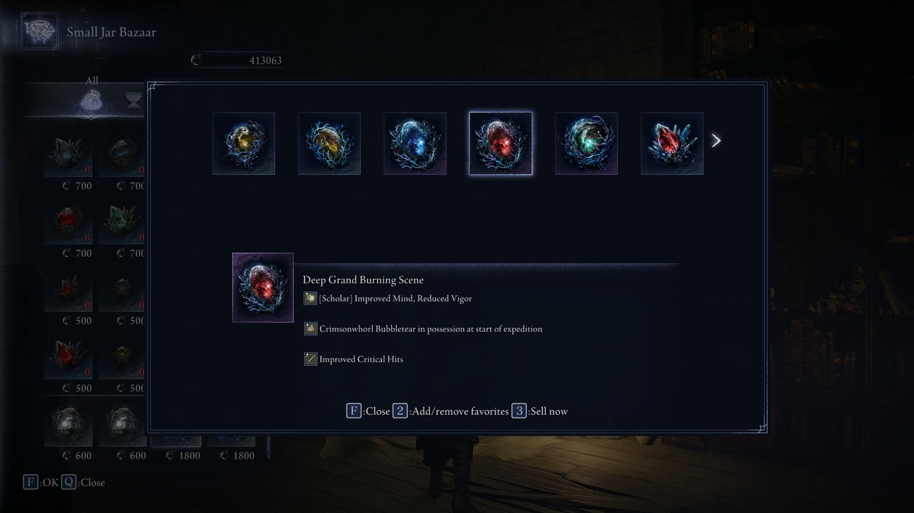

## Videos

[](https://www.youtube.com/watch?v=vXJouNHcaC8)

**▶ [Watch the Demo](https://www.youtube.com/watch?v=vXJouNHcaC8)** — see the bot in action: full farming cycle, scanning relics, and how to commit a result to your save.

**▶ [Watch the Setup Walkthrough](https://www.youtube.com/watch?v=qbmUDL8TH5U)** — full configuration walkthrough for first-time users.

---

Each iteration the bot:
1. Restores a clean save file and relaunches the game
2. Navigates to the Relic Rites merchant (Phase 0 — runs once per iteration)
3. Buys a relic and scans the post-buy preview screen (Phase 1 — repeated per cycle)
4. Navigates right through each relic in the Relic Rites panel and captures/analyzes each one (Phase 2)
5. Resets back to the buy screen with a single F press (Phase 3), then repeats from Phase 1
6. Saves every iteration — folders renamed to HIT or GOD ROLL when a relic matches your criteria

Works fully offline. No internet connection required after initial setup.

---

## Quick Start

1. **Download** the latest release ZIP from the [Releases](https://github.com/PulgoMaster/Pulgo-Elden-Ring-Nightreign-Relic-Farming-Bot/releases) page
2. **Extract** the ZIP to any local folder (e.g. `C:\RelicBot\`) — avoid cloud-synced folders (OneDrive, Dropbox, etc.)
3. **Run** `RelicBot.exe`
4. **Configure** your save file path, game executable path, and relic type
5. **Set your criteria** in the Relic Criteria tab
6. **Start** Batch Mode

See [INSTALLATION.md](INSTALLATION.md) for detailed first-time setup.

---

## ⚠️ Important Warnings

- **Back up your save file manually — separately from the bot's own backup.**
  The bot keeps its own working backup, but you should also keep a personal copy you control before you start.
  Your save is located at:
  `C:\Users\<YourName>\AppData\Roaming\Nightreign\<SteamID>\NR0000.sl2`

- **16:9 aspect ratio required.**
  The bot crops specific screen regions using fixed fractions tuned for 16:9 displays.
  Any resolution works (1080p, 1440p, 4K) as long as the aspect ratio is 16:9.
  Ultrawide (21:9), 4:3, and other non-standard aspect ratios are **not supported** —
  OCR crops will land on the wrong areas and the bot will not function correctly.

- **Always give the bot your most current save.**
  The bot restores that save before every iteration — it must be from before any run you have played.
  If you play a run after setting up the bot, make a fresh save at Roundtable Hold and update the path in the bot.
  Running from an outdated save risks being flagged by Nightreign's anti-cheat system.

---

## Requirements

- **Windows 10 or 11**
- **Elden Ring Nightreign** installed via Steam
- **16:9 display** (any resolution — 1080p, 1440p, 4K all work)
- No Python or other software required — everything is bundled in the EXE

---

## Configuration

After launching the EXE, fill in your save file path, backup folder, and game executable path:

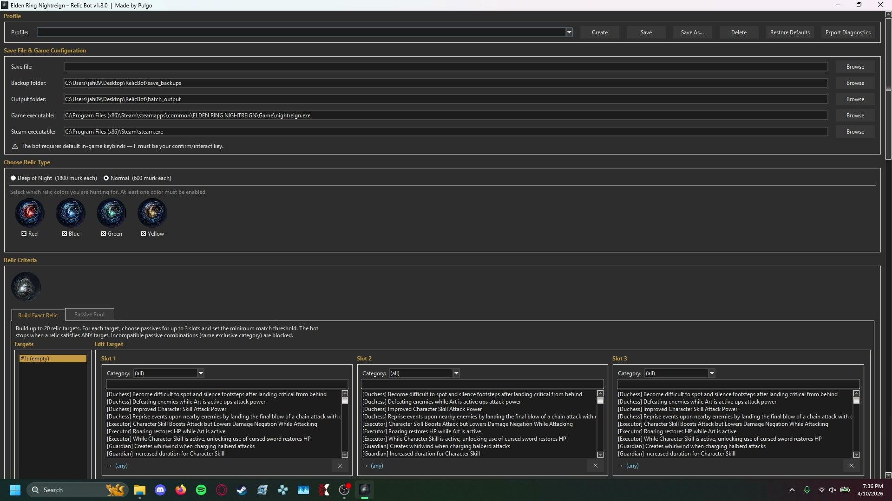

---

## Relic Criteria

The bot has two ways to specify what you're hunting for. You can use either or combine both.

### Build Exact Relic

Specify up to 20 target passive combinations. Each target has up to 3 slots and a match threshold (e.g. 2 of 3 must be present). The bot stops when ANY target is satisfied. Incompatible passives are blocked automatically — selecting a passive from an exclusive compat group hides conflicting passives in the remaining slots.

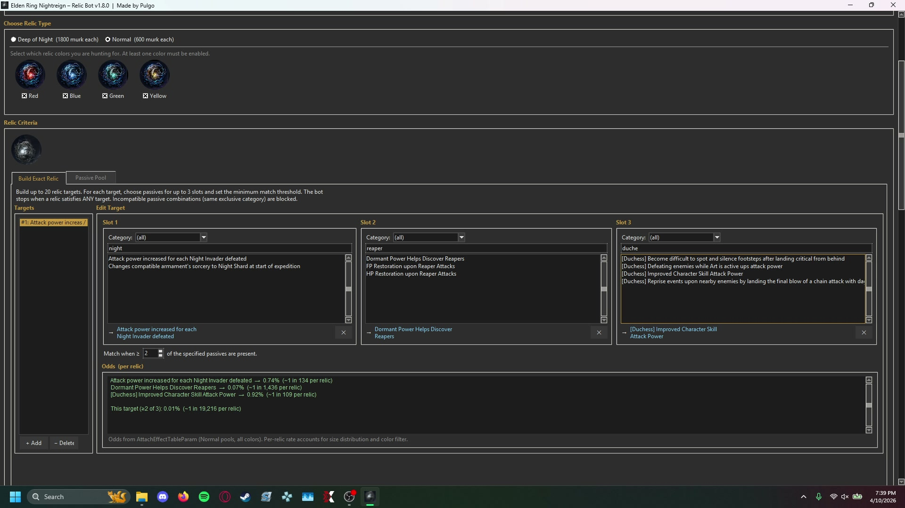

### Passive Pool

Pick any number of passives; match when a relic has at least N of them simultaneously.

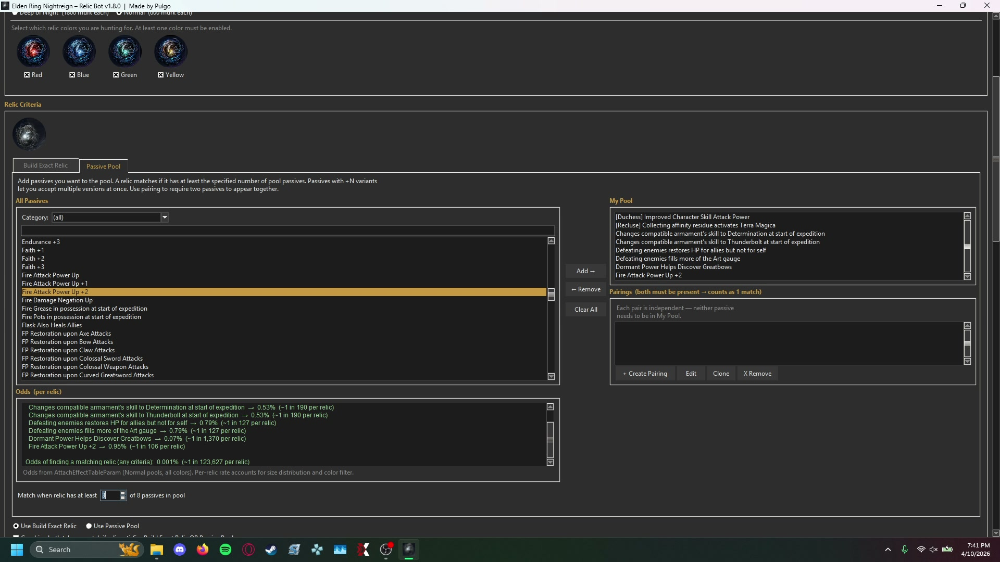

Add **Pairings** to require two specific passives to appear together (counts as one match toward the threshold):

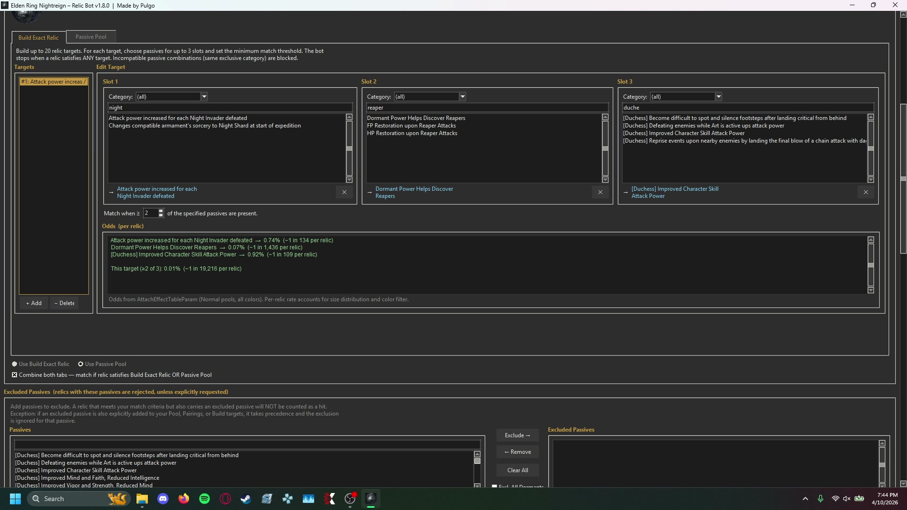

### Combine

Tick the checkbox at the bottom to match against either tab simultaneously.

---

## Batch Mode Settings

Configure parallel workers, async analysis, GPU acceleration, and the overlay HUD. The bot auto-detects your hardware and recommends settings:

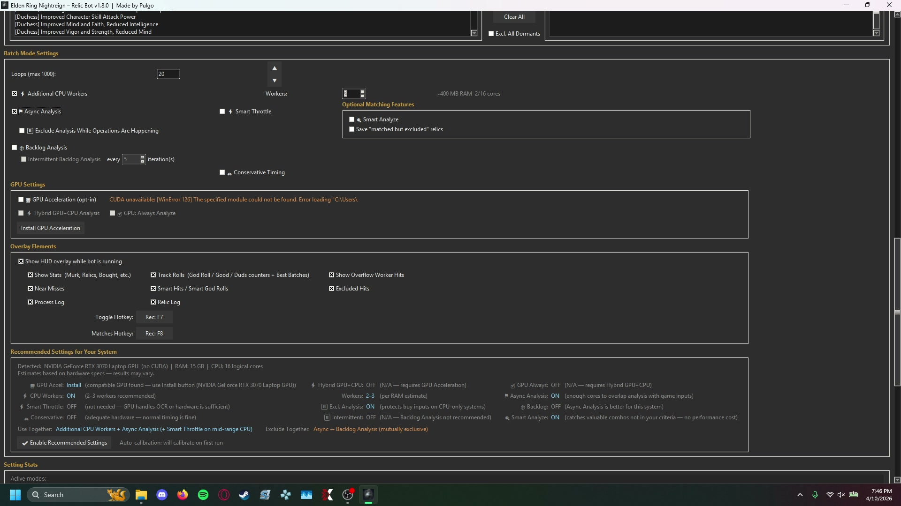

---

## Odds Viewer

The bot calculates the exact probability of finding your target relic based on the datamined pool weights, color filters, and curse exclusions. Numbers update live as you change your criteria:

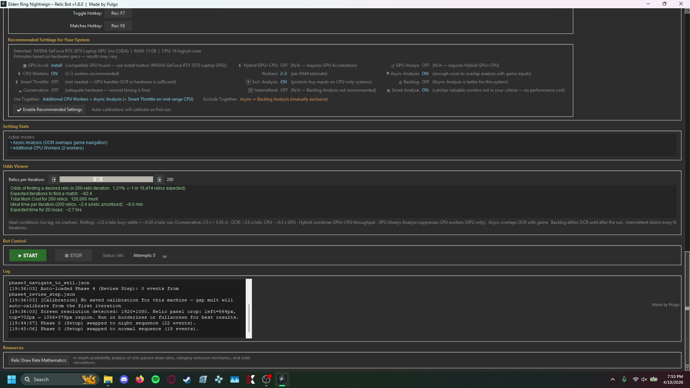

---

## GPU Acceleration (Optional)

The bot works on CPU out of the box. If you have an **NVIDIA GPU** (GTX 10-series or newer), you can install GPU acceleration from inside the bot:

1. Open **Batch Mode Settings**
2. Click **Install GPU Acceleration**
3. Wait for the ~2.5 GB download to complete
4. Restart RelicBot

GPU mode reduces OCR time from ~3 seconds per relic to ~0.3 seconds.

---

## Bot In Action

Once configured, the bot runs the entire farming loop autonomously. It launches the game, navigates to the Small Jar Bazaar, buys relics in batches of 10, and scans each one for matches:

**Phase 0/3 — Navigating the shop**

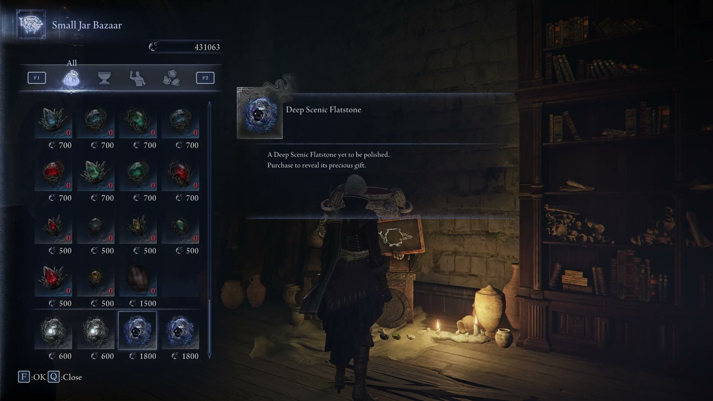

**Phase 1 — Buying 10 relics at once**

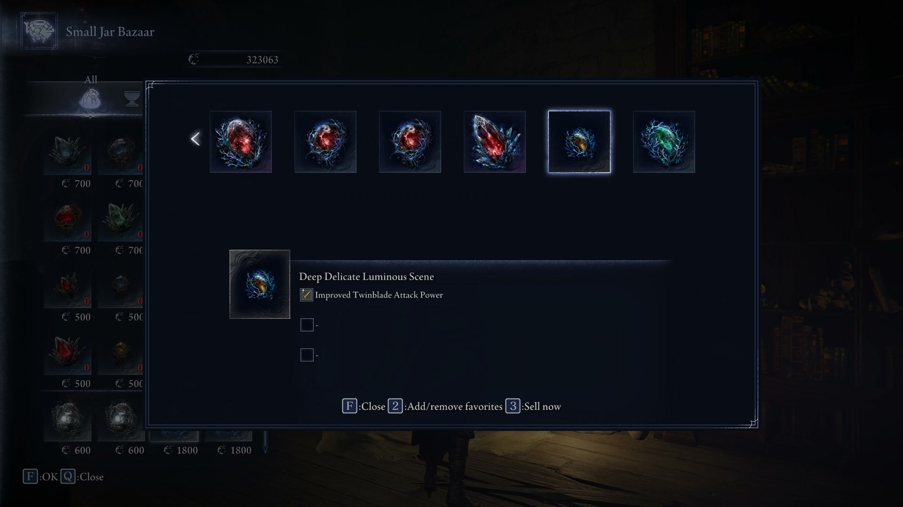

**Phase 2 — Scanning each relic with OCR**


**Run complete**

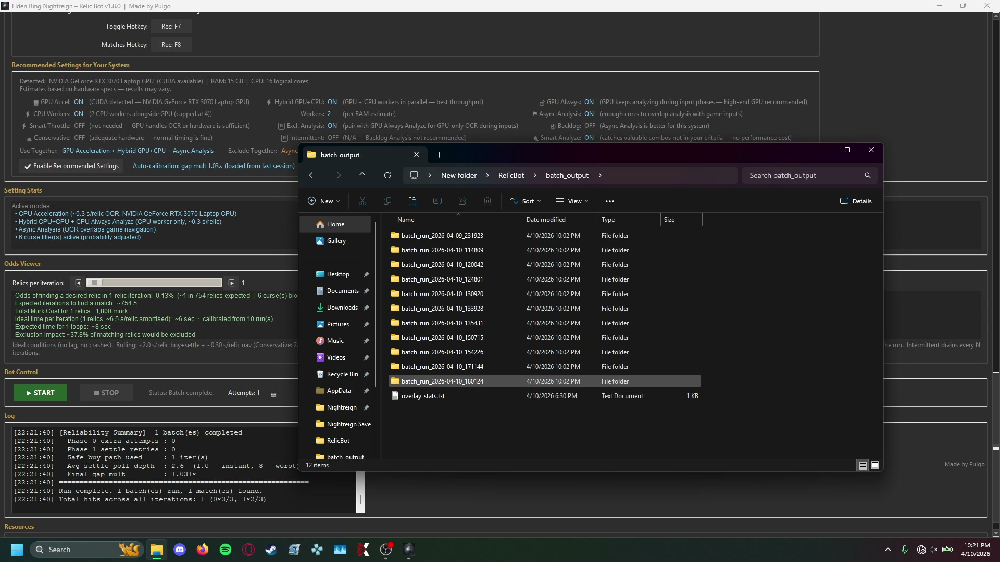

---

## Reviewing Results

Every iteration is saved with screenshots and a save file. Folders are renamed automatically based on what was found:

```
batch_output/
└── batch_run_2026-04-10_143022/
    ├── run_log.txt              Full log of everything the bot printed
    ├── live_log.txt             Per-relic analysis summary
    ├── matches_log.txt          All matched relics in one place
    ├── README.txt               Full breakdown of every iteration (hits marked with *)
    ├── 001/
    │   ├── NR0000.sl2
    │   └── info.txt
    ├── HIT 004/                 Relic met your match threshold
    │   ├── NR0000.sl2
    │   ├── info.txt
    │   └── relic_02_MATCH.jpg
    ├── GOD ROLL 007/            All passives matched
    │   ├── NR0000.sl2
    │   ├── info.txt
    │   └── relic_05_MATCH.jpg
    └── Smart Analyze Hits/      Relics flagged by Smart Analyze
```

Each iteration folder contains the relic screenshot and an `NR0000.sl2` save file:

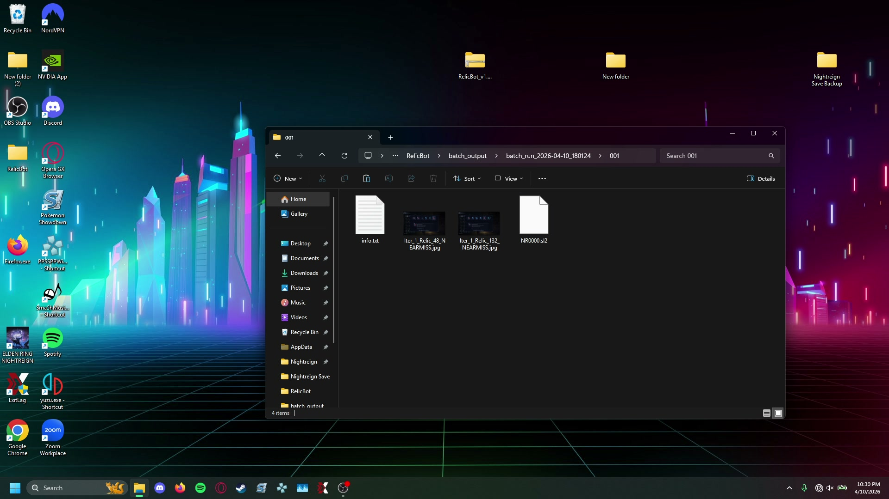

Open the screenshot to confirm the relic before committing it to your game:

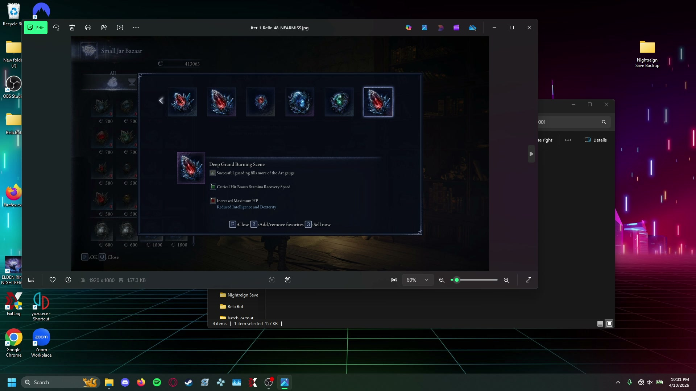

To claim a relic, copy the `NR0000.sl2` from its iteration folder over your existing Nightreign save file at `AppData/Roaming/Nightreign/<your SteamID>/`:

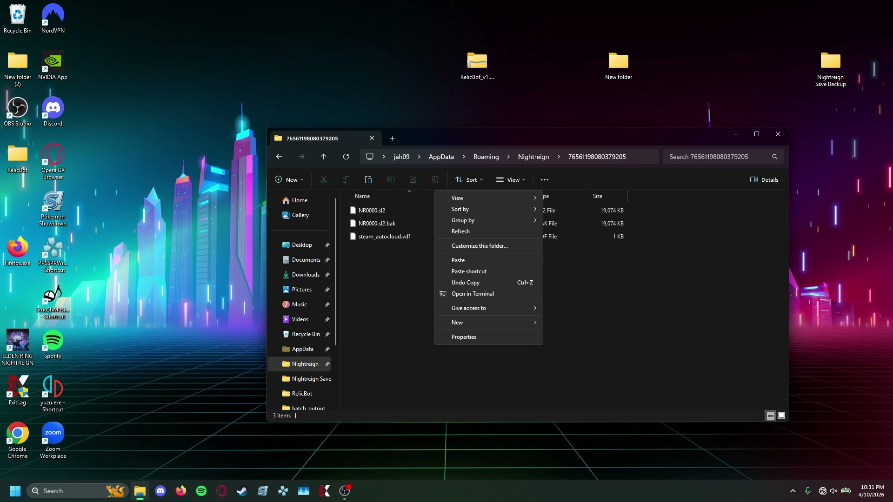

---

## Tips for Best Results

- **Start with as much Murk as possible.** The bot calculates how many relics it can afford each iteration based on your current Murk balance. More Murk = more relics reviewed per run = fewer total iterations needed to find a match.
- **The bot automatically boosts the game's process priority** to HIGH after each load. This reduces input-drop frequency on busy systems and helps keep phase timing consistent over long runs.
- Run the game in **Borderless Windowed** mode. Fullscreen and standard windowed both shift the capture area and will cause OCR to read the wrong screen regions.

---

## Hotkeys

| Key | Action |
|-----|--------|
| **F7** | Show / hide the overlay HUD |
| **F8** | Toggle overlay between the normal log view and the full Matched Relics panel |
| **F9** | Stop the bot after the current iteration completes |

Overlay hotkeys work even while the Nightreign window has focus. Inputs are automatically blocked if the Nightreign window loses focus — alt-tabbing is safe.

---

## Input Sequences & Compatibility

The included input sequences work regardless of DLC ownership, character, or shop unlock state. The phase architecture navigates directly to the Relic Rites merchant and does not depend on your Roundtable Hold layout.

If a sequence ever fails on your machine (e.g. due to unusual timing), use the built-in recording tool to re-record it for your setup. See [SETUP.md](SETUP.md) for step-by-step recording instructions.

---

## Bug Reports

If you encounter a bug, open an issue on the [Issues page](https://github.com/PulgoMaster/Pulgo-Elden-Ring-Nightreign-Relic-Farming-Bot/issues). Include the `run_log.txt` and `diagnostic_*.diag` file from your batch run folder — these contain everything needed to diagnose the problem.
